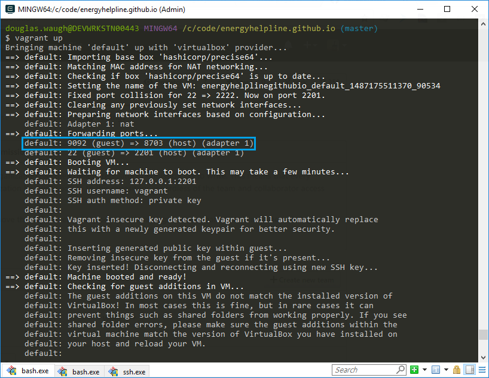

The blog is forked from [Jekyll Now](https://github.com/barryclark/jekyll-now)

In order to get the site running locally

1.  [Install Vagrant](https://www.vagrantup.com/downloads.html)
2.  Run `vagrant up` from this directory
3.  `vagrant ssh` in to the box
4.  `cd /vagrant` once you've ssh'd in
5.  Run `bundle exec jekyll serve --host=0.0.0.0 --port=[GUEST_PORT]`

    GUEST_PORT is the port vagrant assigned for the guest to forward to the VM.  In the following screenshot you can see the guest port is 9092.
    
    GUEST_PORT is randomly generated and will be different each time you `vagrant up`.
    
    

6.  Open a browser on your host machine and browse to http://localhost:[HOST_PORT]

    HOST_PORT is the port vagrant assigned for the host to forward to the VM  In the previous screenshot you can see the host port is 8703.

    HOST_PORT is randomly generated and will be different each time you `vagrant up`.